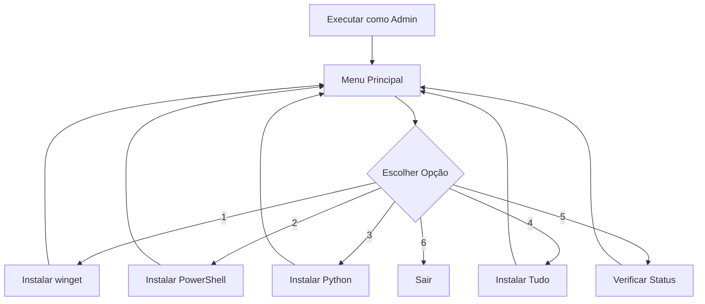

# 🚀 Instalador Automático - Windows

Um script em lote (.bat) para instalar automaticamente ferramentas essenciais de desenvolvimento no Windows usando janelas separadas, garantindo que a janela principal nunca feche acidentalmente.

## 📋 O que este script instala

1. **App Installer (winget)** - Gerenciador de pacotes oficial da Microsoft
2. **PowerShell 7.5** - Versão mais recente do PowerShell multiplataforma
3. **Python** - Versão escolhida pelo usuário (3.9, 3.10, 3.11, ou 3.12)

## ✨ Características Principais

- 🪟 **Janelas Separadas**: Cada instalação roda em uma janela independente
- 🔒 **Janela Principal Imortal**: Nunca fecha automaticamente
- 📱 **Menu Interativo**: Interface amigável com opções claras
- 🔄 **Instalação Individual**: Instale apenas o que precisar
- 🛡️ **À Prova de Falhas**: Continua funcionando mesmo se algo der errado

## 🎯 Requisitos

- Windows 10/11
- Executar como **Administrador**
- Conexão com a internet

## 🚀 Como usar

### 1. Download e Preparação
```bash
1. Baixe o arquivo installer.bat
2. Clique com o botão direito no arquivo
3. Selecione "Executar como administrador"
```

### 2. Menu Principal
```
========================================
 INSTALADOR AUTOMÁTICO - JANELA IMORTAL
========================================
 Esta janela NUNCA vai fechar automaticamente!
========================================

MENU PRINCIPAL:

1. Instalar App Installer (winget)
2. Instalar PowerShell 7.5
3. Instalar Python
4. Instalar TUDO (sequencial)
5. Verificar status das instalações (Nao implementado)
6. Sair

Digite sua escolha (1-6):
```

### 3. Opções Disponíveis

#### Opção 1: App Installer
- Instala o winget (se não estiver instalado)
- Abre janela separada para a instalação
- Retorna ao menu principal

#### Opção 2: PowerShell 7.5
- Instala PowerShell 7.5 via winget
- Processo em janela separada
- Disponível na próxima sessão do terminal

#### Opção 3: Python
- Abre janela interativa para escolher versão
- Opções: Python 3.12, 3.11, 3.10
- Instalação automática da versão selecionada

#### Opção 4: Instalação Completa
- App Installer → PowerShell 7.5 → Python
- Processo totalmente automatizado

#### Opção 5: Verificar Status
```
========================================
 STATUS DAS INSTALAÇÕES
========================================

[OK] App Installer (winget): Instalado
[OK] PowerShell 7.5: Instalado
[OK] Python: Python 3.12.7
```

#### Opção 6: Sair
- Encerra o script de forma controlada

## 🔧 Como Funciona

### Arquitetura de Janelas Separadas
```
┌─────────────────────┐    ┌─────────────────────┐
│   Janela Principal  │    │  Janela Instalação  │
│                     │    │                     │
│  • Menu permanente  │────│  • Instala software │
│  • Monitora status  │    │  • Salva resultado  │
│  • Nunca fecha      │    │  • Fecha ao final   │
└─────────────────────┘    └─────────────────────┘
```

### Sistema de Comunicação
1. **Janela Principal** cria script temporário
2. **Nova janela** executa instalação
3. **Resultado** salvo em arquivo temporário
4. **Janela Principal** lê resultado e continua

### Fluxo de Instalação


## ⚙️ Detalhes Técnicos

### Scripts Temporários
O script cria arquivos temporários em `%TEMP%` para cada instalação:
- `install_winget.bat` - Instalação do App Installer
- `install_ps7.bat` - Instalação do PowerShell 7.5
- `install_python.ps1` - Script PowerShell para Python
- `install_python.bat` - Wrapper para o script Python

### Arquivos de Status
Comunicação entre janelas via arquivos temporários:
- `winget_status.txt` - Status da instalação do winget
- `ps7_status.txt` - Status da instalação do PowerShell
- `python_status.txt` - Status da instalação do Python

### Comandos de Instalação

#### App Installer (winget)
```powershell
Invoke-WebRequest -Uri 'https://github.com/microsoft/winget-cli/releases/latest/download/Microsoft.DesktopAppInstaller_8wekyb3d8bbwe.msixbundle' -OutFile '$env:TEMP\winget.msixbundle'
Add-AppxPackage '$env:TEMP\winget.msixbundle'
```

#### PowerShell 7.5
```batch
winget install Microsoft.PowerShell --accept-package-agreements --accept-source-agreements --silent
```

#### Python
```batch
winget install Python.Python.3.12 --accept-package-agreements --accept-source-agreements --silent
```

## 🐛 Solução de Problemas

### Script não inicia
- **Causa**: Não está executando como administrador
- **Solução**: Clique direito → "Executar como administrador"

### Janela fecha inesperadamente
- **Não deveria acontecer**: A janela principal foi projetada para ser imortal
- **Se acontecer**: Execute novamente como administrador

### winget não funciona
- **Causa**: App Installer não instalado corretamente
- **Solução**: Use a opção 1 do menu para reinstalar

### PowerShell 7.5 não disponível
- **Causa**: Instalação recente, PATH não atualizado
- **Solução**: Reinicie o terminal ou use a opção 5 para verificar

### Python não encontrado
- **Causa**: PATH não atualizado após instalação
- **Solução**: Reinicie o terminal ou adicione Python ao PATH manualmente

## 📝 Logs e Verificação

### Verificação Manual
Para verificar se tudo está funcionando:

```batch
# Verificar winget
winget --version

# Verificar PowerShell 7.5
pwsh --version

# Verificar Python
python --version
# ou
python3 --version
# ou
py --version
```

### Localização dos Executáveis
- **winget**: `%LOCALAPPDATA%\Microsoft\WindowsApps\`
- **PowerShell 7.5**: `C:\Program Files\PowerShell\7\`
- **Python**: `%LOCALAPPDATA%\Programs\Python\` ou `C:\Program Files\Python\`

## 🔐 Segurança

- ✅ **Downloads oficiais**: Apenas de repositórios oficiais Microsoft/Python
- ✅ **Verificação de hash**: winget verifica integridade automaticamente
- ✅ **Execução controlada**: Requer privilégios de administrador
- ✅ **Sem downloads suspeitos**: Não baixa de fontes não confiáveis

## 🤝 Contribuição

Este script foi desenvolvido para ser simples e funcional. Sugestões de melhoria são bem-vindas!

### Possíveis Melhorias
- [ ] Instalação de outras ferramentas (Git, VS Code, etc.)
- [ ] Seleção de versões específicas do Python
- [ ] Interface gráfica (GUI)
- [ ] Logs detalhados
- [ ] Configuração de ambiente virtual Python

## 📄 Licença

Este script é de uso livre e gratuito. Use, modifique e distribua conforme necessário.

## 🆘 Suporte

Se encontrar problemas:

1. **Verifique os requisitos** (Windows 10/11, Admin, Internet)
2. **Use a opção 5** para verificar status das instalações
3. **Reinstale individualmente** usando opções 1, 2 ou 3
4. **Consulte a seção de solução de problemas**

---

**Desenvolvido para simplificar a configuração de ambientes de desenvolvimento Windows** 🎯


> ✨ **Criado em:** 8 de ago. de 2025 às 21:22
