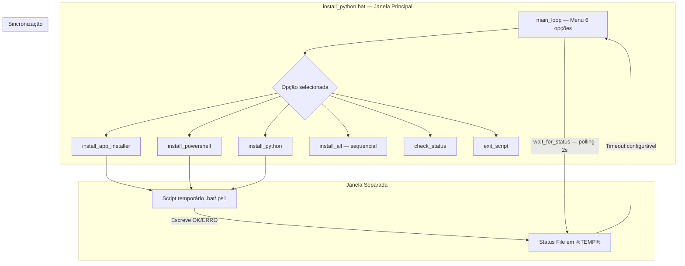

<div align="center">

# instalacao-python-automation

[](https://github.com/ESousa97/instalacao-python-automation/actions/workflows/ci.yml)
[](https://www.codefactor.io/repository/github/esousa97/instalacao-python-automation)
[](https://opensource.org/licenses/MIT)
[](#)

**Automação em Batch para instalação de winget, PowerShell 7 e Python no Windows — menu interativo com 6 opções (individual, sequencial, status, sair), execução de instalações em janelas separadas preservando a janela principal ("Janela Imortal"), sincronização entre processos via status file em `%TEMP%` com timeout configurável, seleção de versão Python (3.10/3.11/3.12) via submenu PowerShell, validação de privilégios administrativos, testes PowerShell (unit + integration), CI no GitHub Actions (windows-latest) e Security Audit semanal com Gitleaks.**

</div>

---

> **⚠️ Projeto Arquivado**
> Este projeto não recebe mais atualizações ou correções. O código permanece disponível como referência e pode ser utilizado livremente sob a licença MIT. Fique à vontade para fazer fork caso deseje continuar o desenvolvimento.

---

## Índice

- [Sobre o Projeto](#sobre-o-projeto)
- [Demonstração](#demonstração)
- [Funcionalidades](#funcionalidades)
- [Tecnologias](#tecnologias)
- [Arquitetura](#arquitetura)
- [Estrutura do Projeto](#estrutura-do-projeto)
- [Começando](#começando)
  - [Pré-requisitos](#pré-requisitos)
  - [Instalação](#instalação)
  - [Uso](#uso)
- [Scripts Disponíveis](#scripts-disponíveis)
- [Testes](#testes)
- [Qualidade e Segurança](#qualidade-e-segurança)
- [FAQ](#faq)
- [Licença](#licença)
- [Contato](#contato)

---

## Sobre o Projeto

Automação em Batch para preparar ambiente de desenvolvimento no Windows com instalações em janelas separadas e monitoramento por status file. O fluxo preserva a janela principal para evitar encerramentos acidentais e organiza instalações de App Installer (winget), PowerShell 7 e Python de forma sequencial ou individual.

O repositório prioriza:

- **"Janela Imortal"** — O script principal (`install_python.bat`) permanece aberto durante todo o fluxo, delegando cada instalação para uma janela separada via `start`. Isso evita encerramento acidental e permite o usuário acompanhar o progresso e retornar ao menu após cada operação
- **Sincronização por status file com timeout** — Comunicação entre processos via arquivos temporários em `%TEMP%` (`OK`/`ERRO`). O loop `:wait_for_status` aguarda o arquivo com polling de 2 segundos e timeout global configurável via `INSTALL_TIMEOUT_SECONDS` (padrão 1800s/30min), prevenindo espera infinita
- **Instalação via winget** — PowerShell 7 e Python são instalados via `winget install` com `--accept-package-agreements --accept-source-agreements --silent`. O App Installer (winget) é instalado via download direto do `.msixbundle` oficial quando ausente
- **Seleção interativa de versão Python** — Submenu PowerShell gerado dinamicamente oferece Python 3.12, 3.11 ou 3.10, com validação de input (`^[1-3]$`) e mapeamento para IDs winget (`Python.Python.3.12`, etc.)
- **Validação de privilégios** — `:ensure_admin` verifica `net session` antes de qualquer operação, exigindo execução como Administrador
- **Testes em PowerShell** — Suite com testes unitários (validação de estrutura do `.bat`: 6 entradas de menu, labels obrigatórios, componentes críticos) e testes de integração (presença de arquivos de governança, workflows CI referenciando lint e testes)
- **Security Audit com Gitleaks** — Workflow semanal (segunda 07:00 UTC) para detecção de secrets/credenciais no repositório

---

## Demonstração

```text
========================================
 INSTALADOR AUTOMATICO - JANELA IMORTAL
========================================
 Versao: 2.0.0
 Esta janela nao fecha automaticamente.
========================================

MENU PRINCIPAL:

1. Instalar App Installer (winget)
2. Instalar PowerShell 7
3. Instalar Python
4. Instalar TUDO (sequencial)
5. Verificar status das instalacoes
6. Sair
```

---

## Funcionalidades

- **Instalar App Installer (winget)** — Download e instalação do `.msixbundle` oficial via PowerShell `Invoke-WebRequest` + `Add-AppxPackage`, com detecção prévia se já está instalado
- **Instalar PowerShell 7** — Via `winget install Microsoft.PowerShell` em janela separada, com dependência automática de winget (instala se ausente)
- **Instalar Python** — Submenu PowerShell com seleção de versão (3.12/3.11/3.10), instalação via `winget install Python.Python.3.XX` em janela separada
- **Instalar TUDO (sequencial)** — Executa as 3 instalações em ordem: App Installer → PowerShell 7 → Python, com feedback `[1/3]`, `[2/3]`, `[3/3]`
- **Verificar status** — Checa presença e versão de winget, PowerShell 7 (`pwsh`) e Python (`py`/`python`) no PATH, exibindo `[OK]` ou `[X]`
- **Timeout configurável** — `INSTALL_TIMEOUT_SECONDS` via `.env` ou variável de ambiente (padrão 1800s), previne espera infinita em instalações interrompidas
- **Detecção de dependências** — Instalações de PowerShell e Python verificam e instalam winget automaticamente se necessário

---

## Tecnologias


---

## Arquitetura


```mermaid
graph TD
    subgraph "install_python.bat — Janela Principal"
        A[main_loop — Menu 6 opções] --> B{Opção selecionada}
        B --> C[install_app_installer]
        B --> D[install_powershell]
        B --> E[install_python]
        B --> F[install_all — sequencial]
        B --> G[check_status]
        B --> H[exit_script]
    end

    subgraph "Janela Separada"
        C --> I[Script temporário .bat/.ps1]
        D --> I
        E --> I
        I -- "Escreve OK/ERRO" --> J[Status File em %TEMP%]
    end

    subgraph "Sincronização"
        A -- "wait_for_status — polling 2s" --> J
        J -- "Timeout configurável" --> A
    end
```

### Decisões de Design

| Decisão | Justificativa |
| --- | --- |
| Script principal em Batch | Compatibilidade nativa com Windows sem dependências adicionais |
| Instalações em janelas separadas (`start`) | Janela principal permanece disponível, evita encerramento acidental |
| Sincronização por status file em `%TEMP%` | Mecanismo simples e estável para comunicação entre processos sem infraestrutura extra |
| Timeout global de tarefa (1800s padrão) | Previne espera infinita quando instalação é interrompida externamente |
| Submenu Python em PowerShell (gerado dinamicamente) | Validação de input e mapeamento de versões mais robustos que em Batch puro |

### Labels do Script Principal

O `install_python.bat` é organizado em 8 labels com responsabilidade única:

`main_loop` · `ensure_admin` · `install_app_installer` · `install_powershell` · `install_python` · `install_all` · `check_status` · `wait_for_status` · `exit_script`

---

## Estrutura do Projeto

```
instalacao-python-automation/
├── install_python.bat                          # Script principal — menu + instalações + sincronização
├── scripts/
│   ├── lint.ps1                                # Lint estrutural (delega para validate-repo.ps1)
│   ├── build.ps1                               # No-op validado (projeto Batch)
│   └── validate-repo.ps1                       # Validação completa: arquivos, labels, .gitignore, modo strict
├── tests/
│   ├── run.ps1                                 # Runner da suíte (unit + integration)
│   ├── unit/
│   │   └── install_python_batch.tests.ps1      # Valida menu, labels, componentes do .bat
│   ├── integration/
│   │   └── repository_integration.tests.ps1    # Valida governança, CI, docs
│   └── e2e/
│       └── README.md                           # Checklist manual (requer elevação)
├── docs/
│   ├── architecture.md                         # Decisões arquiteturais e fluxo
│   └── setup.md                                # Setup e validação local
├── .github/
│   ├── workflows/
│   │   ├── ci.yml                              # Lint + Test + Build (windows-latest)
│   │   └── security-audit.yml                  # Gitleaks semanal (segunda 07:00 UTC)
│   ├── ISSUE_TEMPLATE/
│   │   ├── bug_report.yml                      # Com aviso de archived
│   │   ├── feature_request.yml
│   │   └── config.yml                          # Blank issues disabled
│   ├── PULL_REQUEST_TEMPLATE.md
│   ├── CODEOWNERS                              # @enoquesousa
│   ├── FUNDING.yml
│   └── dependabot.yml                          # GitHub Actions (PRs desabilitados)
├── .editorconfig                               # UTF-8, LF, indent 2
├── .gitattributes                              # LF normalizado, CRLF para .bat/.cmd
├── .gitignore
├── .env.example                                # INSTALL_TIMEOUT_SECONDS, PYTHON_PACKAGE_ID
├── CHANGELOG.md                                # Keep a Changelog (v2.0.0 → v2.0.1)
├── CONTRIBUTING.md                             # Conventional Commits + validação local
├── CODE_OF_CONDUCT.md                          # Contributor Covenant 2.1
├── SECURITY.md                                 # Política de disclosure + SLA
└── LICENSE                                     # MIT
```

---

## Começando

### Pré-requisitos

- Windows 10 ou Windows 11
- Execução como **Administrador**
- Conexão com internet
- Git (para clonar o repositório)

### Instalação

```powershell
git clone https://github.com/enoquesousa/instalacao-python-automation.git
cd instalacao-python-automation
```

Opcionalmente, configure variáveis:

```powershell
Copy-Item .env.example .env
```

### Uso

```powershell
Start-Process -FilePath .\install_python.bat -Verb RunAs
```

O menu interativo será exibido. Selecione a opção desejada (1-6).

---

## Scripts Disponíveis

```powershell
# Lint estrutural (arquivos, labels, .gitignore)
pwsh -File scripts/lint.ps1

# Testes (unit + integration)
pwsh -File tests/run.ps1

# Build (no-op validado — projeto Batch)
pwsh -File scripts/build.ps1

# Validação completa com regras estritas
pwsh -File scripts/validate-repo.ps1 -Strict
```

---

## Testes

```powershell
pwsh -File tests/run.ps1
```

**Testes unitários** (`install_python_batch.tests.ps1`):
- Verifica presença das 6 entradas de menu no `.bat`
- Valida componentes obrigatórios: `choice /c 123456`, `STATUS_TIMEOUT_SECONDS`, `setlocal EnableExtensions EnableDelayedExpansion`

**Testes de integração** (`repository_integration.tests.ps1`):
- Verifica presença de arquivos de governança (workflows, issue templates, CODEOWNERS, docs)
- Valida que o CI referencia `scripts/lint.ps1` e `tests/run.ps1`

**E2E** — Checklist manual (requer elevação de privilégio):
1. Executar `install_python.bat` como Administrador
2. Validar opções 1-6 do menu
3. Confirmar retorno ao menu após cada fluxo
4. Confirmar saída controlada na opção 6

---

## Qualidade e Segurança

- **CI** — GitHub Actions em `windows-latest`: Lint (`validate-repo.ps1 -Strict`) → Test (unit + integration) → Build (no-op validado)
- **Security Audit** — Gitleaks semanal (segunda 07:00 UTC) para detecção de secrets/credenciais + `workflow_dispatch` para execução manual
- **Lint estrutural** — `validate-repo.ps1` verifica: 13 arquivos obrigatórios, 8 labels no `.bat`, entradas no `.gitignore`, modo `-Strict` detecta textos legados e valida controle de timeout
- **Dependabot** — GitHub Actions (PRs desabilitados — projeto archived)
- **Governança** — Issue templates YAML com aviso de archived, PR template com checklist, CODEOWNERS, FUNDING.yml, CODE_OF_CONDUCT.md, SECURITY.md com SLA

---

## FAQ

<details>
<summary><strong>Por que Batch e não PowerShell puro?</strong></summary>

Batch é nativo em qualquer instalação Windows sem dependências adicionais. O script funciona mesmo quando PowerShell 7 ainda não está instalado — que é justamente um dos objetivos do projeto. PowerShell é usado como auxiliar para operações que requerem mais robustez (download, submenu de versão Python).
</details>

<details>
<summary><strong>Como funciona a sincronização entre janelas?</strong></summary>

Cada instalação gera um script temporário que escreve `OK` ou `ERRO` em um arquivo de status em `%TEMP%`. O loop `:wait_for_status` na janela principal faz polling a cada 2 segundos e encerra após receber o status ou atingir o timeout (`INSTALL_TIMEOUT_SECONDS`, padrão 1800s).
</details>

<details>
<summary><strong>Por que a "Janela Imortal"?</strong></summary>

Instalações via `winget` ou `Add-AppxPackage` podem fechar a janela onde são executadas ao concluir. Ao delegar para janelas separadas via `start`, a janela principal permanece aberta e o usuário não perde o fluxo do menu. O nome "Janela Imortal" é o conceito central do design.
</details>

<details>
<summary><strong>Posso configurar o timeout?</strong></summary>

Sim. Defina `INSTALL_TIMEOUT_SECONDS` no `.env` ou como variável de ambiente antes de executar. O padrão é 1800 segundos (30 minutos). Valores ≤0 são ignorados e o padrão é restaurado.
</details>

---

## Licença

Este projeto está sob a licença MIT. Veja o arquivo [LICENSE](LICENSE) para mais detalhes.

```
MIT License - você pode usar, copiar, modificar e distribuir este código.
```

---

## Contato

**José Enoque Costa de Sousa**

[](https://www.linkedin.com/in/enoque-sousa-bb89aa168/)
[](https://github.com/ESousa97)
[](https://enoquesousa.vercel.app)

---

<div align="center">

**[⬆ Voltar ao topo](#instalacao-python-automation)**

Feito com ❤️ por [José Enoque](https://github.com/ESousa97)

**Status do Projeto:** Archived — Sem novas atualizações

</div>
